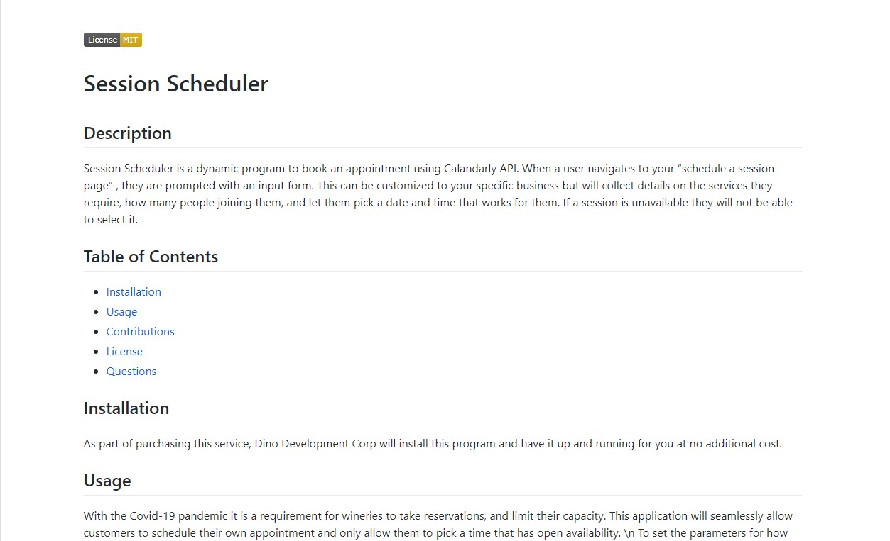

  # Readme Generator

  ## Description
  This project for UC Berkeley Extension's Full Stack Web Development course is a professional readme generator.  I used Node along with the inquirer and FS packages.  
  When node index is typed into the console it will take you through a series of questions.  Once completed that data will be used to write a readme file.  The markdown template is on a different JS file where it will take in the the data and dynamically generate a professional Readme using proper Markdown to look good.  The links in the Readme's table of contents will navigate to different sections of my readme.  
  The git hub link will direct you to the github for the given username, and the email link will open a new email in your email server.  

  ## Image
  Here is an example of the Readme prompt

  

  Here is an example of the generated Readme:

  

  ## Video

  Link to my video explaining project:

  https://youtu.be/BivBMRq0e_w

  ## Questions

  [Github](https://github.com/a)
  
  Email me: n.dino90@gmail.com
